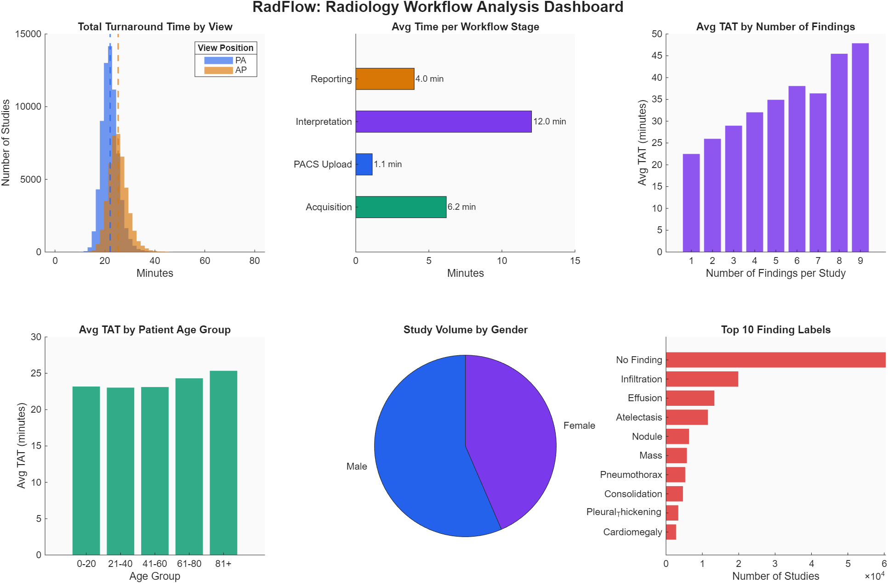
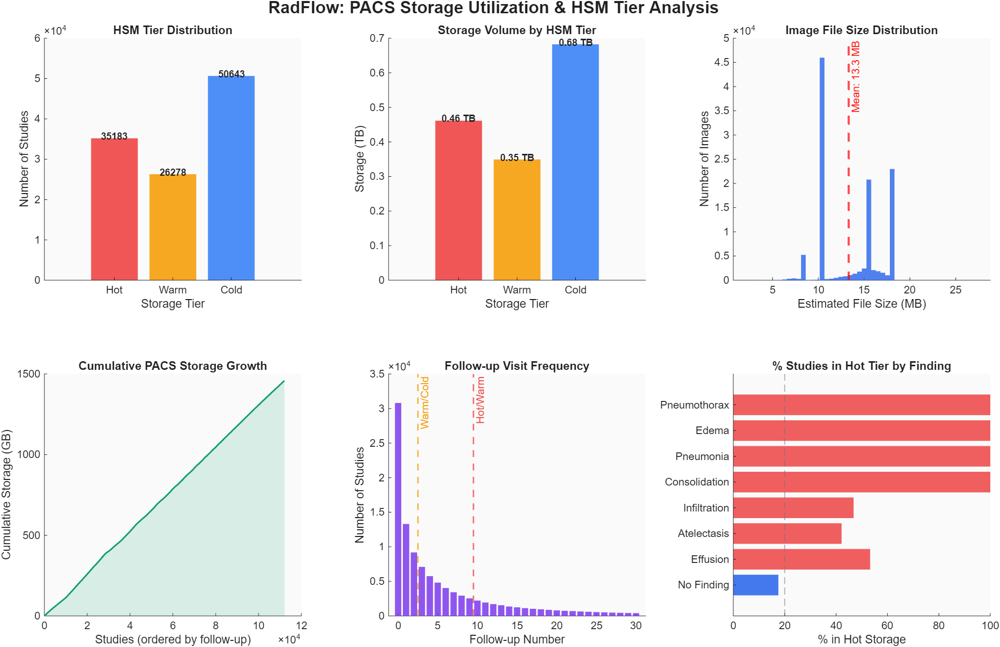
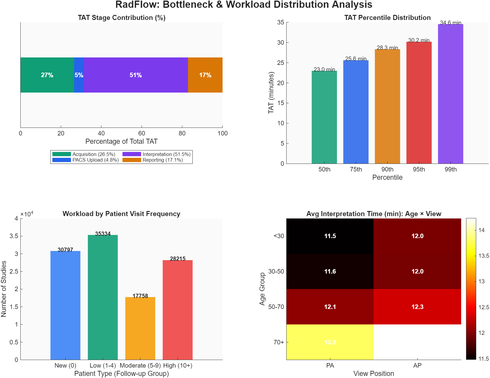
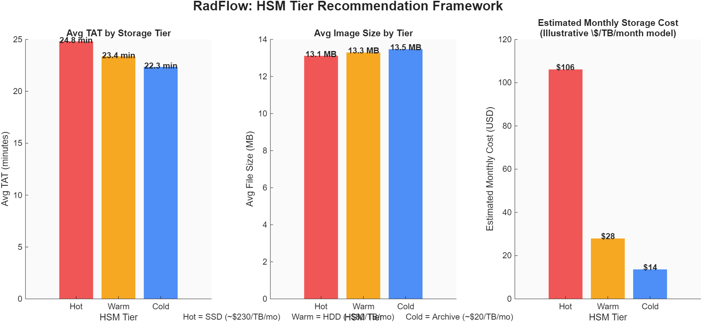

# RadFlow: Radiology Workflow and PACS Optimization Analysis

## Overview

RadFlow analyzes radiology department efficiency using the publicly available
NIH Chest X-ray dataset (112,120 studies from 30,805 patients). Since the
dataset has no timestamps, the project **simulates** realistic workflow
turnaround times (acquisition → PACS upload → interpretation → reporting) and
applies a rule-based Hierarchical Storage Management (HSM) framework to model
PACS storage tiering and cost.

> **Note on data:** The workflow timing values (turnaround times, delays,
> bottleneck stages) are simulated using distributions informed by published
> radiology operations literature — they are not real measured hospital data.
> The HSM tier assignments (Hot / Warm / Cold) are rule-based, driven by
> clinical criticality and follow-up visit frequency from the real dataset.

## Repository Contents

| File | Description |
|---|---|
| `RadFlow_Combined.m` | Main MATLAB analysis script — cleans the data, simulates workflow times, assigns PACS storage tiers, and generates all 4 figures |
| `Project_report.docx` | Full written report: methodology, results, and discussion |
| `Project797_Presentation.pptx` | Slide deck summarizing the project |
| `figures/` | The 4 generated dashboard PNGs (see Visualizations below) |
| `README.md` | This file |

## How to Run

1. Download the NIH Chest X-ray dataset metadata file `Data_Entry_2017.csv`
   from the [NIH Clinical Center dataset page](https://nihcc.app.box.com/v/ChestXray-NIHCC)
   (or [Kaggle mirror](https://www.kaggle.com/datasets/nih-chest-xrays/data)).
2. Place `Data_Entry_2017.csv` in the same folder as `RadFlow_Combined.m`.
3. Open MATLAB and navigate to that folder.
4. Run:
   ```matlab
   RadFlow_Combined
   ```
5. Output (saved to the same folder):
   - `fig1_workflow_dashboard.png` — TAT distributions, stage times, findings, demographics
   - `fig2_pacs_hsm.png` — storage tier distribution, volume, and growth
   - `fig3_bottleneck_workload.png` — TAT stage contribution, percentiles, workload
   - `fig4_hsm_framework.png` — tier recommendation and estimated storage cost
   - `RadFlow_Final_Processed_Dataset.csv` — cleaned dataset with all derived columns

**Requirements:** MATLAB (tested on a recent release) with base toolboxes
only — no additional toolboxes required. `rng(42)` is set for reproducibility.

## Visualizations

**Figure 1 — Workflow Overview Dashboard**
TAT distribution by view, avg time per stage, findings, age groups, gender split, top findings.


**Figure 2 — PACS Storage & HSM Analysis**
HSM tier distribution, storage volume, file size distribution, cumulative growth, follow-up frequency.


**Figure 3 — Bottleneck & Workload Analysis**
TAT stage contribution, percentile distribution, workload by patient type, interpretation time heatmap.


**Figure 4 — HSM Recommendation Framework**
Avg TAT by tier, avg file size by tier, estimated monthly storage cost model.


## Key Findings

- Interpretation is the primary bottleneck stage in the simulated turnaround
  time.
- Studies with critical findings (e.g., pneumothorax, pneumonia) or high
  follow-up frequency are routed to the "Hot" storage tier for fast access.
- A tiered storage strategy (SSD / HDD / Archive) offers meaningful projected
  cost savings over storing all studies on high-performance storage.

See `Project_report.docx` for full methodology and discussion, and
`Project797_Presentation.pptx` for a summarized walkthrough.
